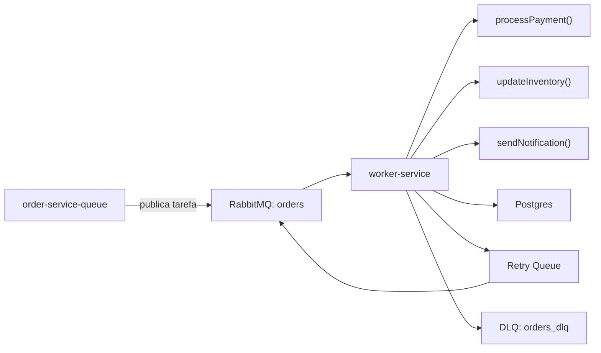
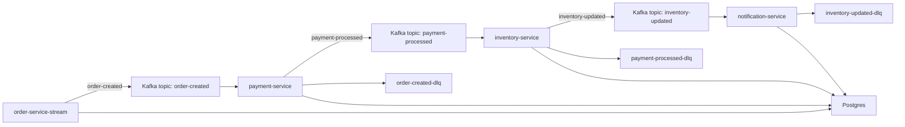
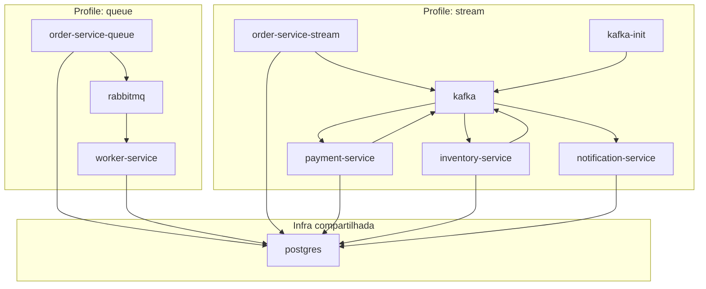

# Order Pipeline — Queue vs Stream

## Visão geral

Este repositório implementa duas arquiteturas diferentes para o mesmo domínio de processamento de pedidos:

* Uma arquitetura orientada a fila (**Queue / task-based**)
* Uma arquitetura orientada a eventos (**Stream / event-based**)

O objetivo do projeto é demonstrar, de forma prática, como o fluxo operacional, o desacoplamento entre serviços e o comportamento de mensageria mudam entre os dois modelos.

---

# Domínio

O domínio simula um pipeline simplificado de processamento de pedidos.

Cada pedido passa pelas seguintes etapas:

1. Processamento de pagamento
2. Atualização de estoque
3. Envio de notificação

---

# Estrutura do repositório

```txt
order-pipeline/
├── projects/
│   ├── queue/
│   │   ├── apps/
│   │   │   ├── order-service/       # workspace: order-service-queue
│   │   │   └── worker-service/
│   │
│   └── stream/
│       ├── apps/
│       │   ├── order-service/       # workspace: order-service-stream
│       │   ├── payment-service/
│       │   ├── inventory-service/
│       │   └── notification-service/
│
├── packages/
│   ├── shared-validation/
│   └── logger/
│
├── docker/
│   └── docker-compose.full.yml
│
└── package.json
```

---

# Workspaces

| Pasta                                       | Workspace              | Responsabilidade                           |
| ------------------------------------------- | ---------------------- | ------------------------------------------ |
| `projects/queue/apps/order-service`         | `order-service-queue`  | Criação de pedidos e publicação de tarefas |
| `projects/queue/apps/worker-service`        | `worker-service`       | Processamento centralizado do fluxo        |
| `projects/stream/apps/order-service`        | `order-service-stream` | Publicação do evento inicial               |
| `projects/stream/apps/payment-service`      | `payment-service`      | Processamento de pagamento                 |
| `projects/stream/apps/inventory-service`    | `inventory-service`    | Atualização de estoque                     |
| `projects/stream/apps/notification-service` | `notification-service` | Envio de notificações                      |

---

# Arquitetura Queue

## Componentes

| Serviço               | Responsabilidade                           |
| --------------------- | ------------------------------------------ |
| `order-service-queue` | Criação de pedidos e publicação de tarefas |
| `worker-service`      | Processamento completo do fluxo do pedido  |
| RabbitMQ              | Transporte e retry de mensagens            |
| PostgreSQL            | Persistência de dados                      |

---

## Fluxo



---

## Filas utilizadas

| Fila         | Objetivo          |
| ------------ | ----------------- |
| `orders`     | Fila principal    |
| `orders_dlq` | Dead letter queue |

---

## Payload publicado

```json
{
  "type": "process-order",
  "payload": {
    "orderId": "123",
    "userId": "abc",
    "items": [
      {
        "productId": "p1",
        "qty": 2
      }
    ]
  }
}
```

---

## Características

* Fluxo centralizado em um único worker
* Mensagens representam tarefas
* Retry controlado pela fila
* Dead letter queue para falhas permanentes
* Mensagens removidas após consumo

---

# Arquitetura Stream

## Componentes

| Serviço                | Responsabilidade                                  |
| ---------------------- | ------------------------------------------------- |
| `order-service-stream` | Criação de pedidos e publicação do evento inicial |
| `payment-service`      | Processamento de pagamento                        |
| `inventory-service`    | Atualização de estoque                            |
| `notification-service` | Envio de notificação                              |
| Kafka                  | Distribuição de eventos                           |
| PostgreSQL             | Persistência de dados                             |

---

## Fluxo



---

## Topics utilizados

| Topic               | Objetivo                 |
| ------------------- | ------------------------ |
| `order-created`     | Evento inicial do pedido |
| `payment-processed` | Resultado do pagamento   |
| `inventory-updated` | Atualização de estoque   |

---

## Contrato de eventos

Todos os eventos seguem um envelope padronizado:

```json
{
  "eventId": "evt_123",
  "eventName": "order-created",
  "occurredAt": "2026-05-25T18:00:00.000Z",
  "correlationId": "corr_789",
  "payload": {
    "orderId": "123",
    "userId": "abc",
    "items": [
      {
        "productId": "p1",
        "qty": 2
      }
    ]
  }
}
```

---

## Dead Letter Queues

| DLQ                     | Serviço                |
| ----------------------- | ---------------------- |
| `order-created-dlq`     | `payment-service`      |
| `payment-processed-dlq` | `inventory-service`    |
| `inventory-updated-dlq` | `notification-service` |

---

## Idempotência

Todos os consumidores utilizam controle de idempotência baseado na tabela:

```txt
processed_events
```

Cada serviço mantém seu próprio registro de eventos processados para evitar duplicações e reprocessamentos indevidos.

---

# Observabilidade

O projeto utiliza `@repo/logger` para padronização de logs estruturados.

Campos principais:

| Campo           | Objetivo                 |
| --------------- | ------------------------ |
| `service`       | Serviço emissor          |
| `correlationId` | Rastreamento distribuído |
| `orderId`       | Identificação do pedido  |
| `topic`         | Topic Kafka              |
| `offset`        | Offset consumido         |

---

# Execução local

## Instalação

```bash
npm install
```

---

## Queue

Dependências:

* PostgreSQL
* RabbitMQ

Executar:

```bash
npm run dev:queue
```

---

## Stream

Dependências:

* PostgreSQL
* Kafka
* Topics inicializados via `kafka-init`

Executar:

```bash
npm run dev:stream
```

---

# Docker

O projeto possui execução segmentada utilizando Docker profiles.

Arquivo:

```bash
docker/docker-compose.full.yml
```

---

## Executar arquitetura Queue

```bash
docker compose -f docker/docker-compose.full.yml --profile queue up
```

---

## Executar arquitetura Stream

```bash
docker compose -f docker/docker-compose.full.yml --profile stream up
```

---

# Infraestrutura por profile



---

# Diferenças arquiteturais

| Queue                      | Stream                            |
| -------------------------- | --------------------------------- |
| Mensagem representa tarefa | Mensagem representa evento        |
| Fluxo centralizado         | Fluxo distribuído                 |
| Consumo destrutivo         | Histórico persistente             |
| Worker orquestra etapas    | Serviços reagem independentemente |
| Retry na fila              | Reprocessamento por offset        |

---

# Stack

## Queue

* Node.js
* RabbitMQ
* PostgreSQL
* Docker

---

## Stream

* Node.js
* Apache Kafka
* PostgreSQL
* Docker

---

# Objetivo técnico do projeto

O projeto foi desenvolvido para documentar e comparar duas abordagens reais de comunicação assíncrona:

* processamento orientado a tarefas
* propagação orientada a eventos

A implementação mantém o mesmo domínio e responsabilidades equivalentes entre as duas arquiteturas para evidenciar exclusivamente as diferenças de modelagem, acoplamento e fluxo operacional.
